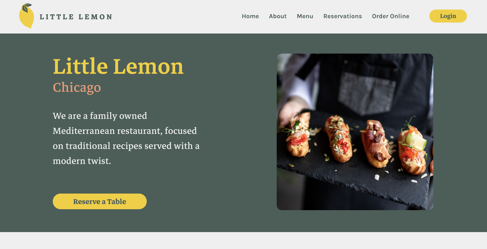

# 🍋 Little Lemon - Frontend Capstone



A **modern restaurant web application** built as part of the Frontend Developer Capstone project.  
The website allows users to explore menus, reserve tables, and order online — featuring a clean UI, responsive layout, and smooth booking flow.

🔗 **Live Demo:** [https://vetacode-frontend-capstone.vercel.app/](https://vetacode-frontend-capstone.vercel.app/)

---

## 🖼️ Preview

| Home Page | Booking Page | Menu Page |
|------------|---------------|-------------------|
|  |  |  |

---

## ✨ Features

- 🏠 **Home Page:** Introduces the restaurant, location, and highlights signature dishes.  
- 📅 **Booking Form:** Users can reserve tables with date and time validation.  
- ✅ **Confirmation Page:** Displays booking details upon submission.  
- 🔐 **Login & Logout System:** Basic session management.  
- 📱 **Fully Responsive:** Optimized for desktop, tablet, and mobile devices.  
- 💡 **Reusable Components:** Built with modular React architecture.

---

## 🧩 Tech Stack

| Category | Tools |
|-----------|--------|
| **Framework** | React.js |
| **Styling** | CSS3 |
| **Routing** | React Router |
| **State Management** | React Context API |
| **Deployment** | Vercel |
| **Testing** | React Testing Library, Jest |

---

## 🗂️ Folder Structure

```
src/
│
├── assets/
│ ├── about/
│ ├── booking/
│ ├── images/
│ ├── specials/
│ ├── testimonials/
│ └── restaurantfood.jpg
│
├── components/
│ ├── About/
│ ├── BookingForm/
│ ├── Card/
│ ├── ConfirmedBooking/
│ ├── Footer/
│ ├── Hero/
│ ├── Modal/
│ ├── NavBar/
│ ├── Specials/
│ └── Testimonials/
│
├── pages/
│ ├── BookingPage.js
│ └── ConfirmedBooking.js
│
├── Hooks/
│ └── LogContext.js
│
├── utils/
│ └── temp.js
│
├── App.js
├── index.js
├── data.js
└── App.css
```
---

## ⚙️ Installation & Setup

To run this project locally:

```bash
# Clone the repository
git clone https://github.com/vetacode/frontend-capstone.git

# Navigate to the project folder
cd frontend-capstone

# Install dependencies
npm install

# Start the development server
npm start


Your app will be live at http://localhost:3000/
 🚀

🚀 Deployment

This project is deployed on Vercel for continuous integration and easy hosting.
You can check the live version here:
👉 https://vetacode-frontend-capstone.vercel.app/

```
## 🧠 Learning Outcomes

**This project demonstrates:**

- Applying React best practices (props, state, hooks)

- Implementing form validation

- Managing UI state via Context API

- Writing unit tests with Jest

- Deploying React apps on Vercel

## 💛 Author

**👤 Fiqrie**
Front-End Developer
**🌐 Portfolio 🐙 GitHub**

## 🏁 Enjoy exploring Little Lemon!
"Fresh ingredients, classic taste — served with a modern twist." 🍋